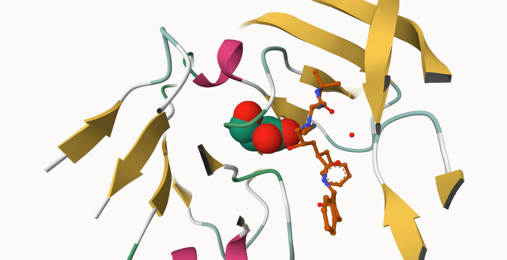
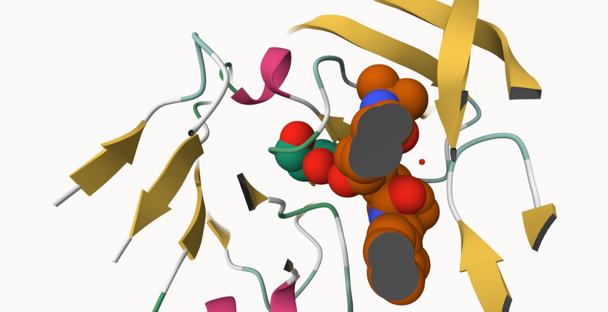

# LAB 10
## Xiomara Perez

PDB STATS
```{r}
pdb_data <- read.csv("pdb_stats.csv")
pdb_data
```

**Q1: What percentage of structures in the PDB are solved by X-Ray and Electron Microscopy.**

> **Answer Q1:** The percentage of structures in the PDB that are solved by X-ray and Electron Microscopy is 93.7892%. 

```{r}
xray_total <- sum(pdb_data$X.ray)

em_total <- sum(pdb_data$EM)

all_total <- sum(pdb_data$Total)

percent_combined <- ((xray_total + em_total)/all_total)*100 
percent_combined
```

**Q2: What proportion of structures in the PDB are protein?**

> **Answer Q2:** The propotion of structures in the PDB that are protein is 97.9118%. 

```{r}
rownames(pdb_data) <- pdb_data$Molecular.Type
protein_only <- pdb_data["Protein (only)","Total"]

protein_oligosaccharide <- pdb_data["Protein/Oligosaccharide", "Total"]


protein_na <- pdb_data["Protein/NA", "Total"]

percent_protein <- (protein_only + protein_oligosaccharide + protein_na)/all_total *100
percent_protein
```

**Q3: Type HIV in the PDB website search box on the home page and determine how many HIV-1 protease structures are in the current PDB?**

> **Answer Q3:** When typing in HIV into the PDB website, and specifying a structure attribute search, selecting structure title and adding "HIV-1 protease" to find that there are 718 HIV-1 protease structures in the current PDB. 


HIV-Pr
### Add a spacefill for Ligand and add a residue property to Polymer.  

## Cleaning up the display 


**Q4: Water molecules normally have 3 atoms. Why do we see just one atom per water molecule in this structure?**

> **Answer Q4:** We only see 1 atom per water molecule in this sticture because we are using the X-ray crystal structure of HIV-1 protease, meaning that only electrons in oxygen atoms are visible. That is beacuse X-rays scatter off electrons, and hydrogen have only 1 electron which is too weak of a signal. Therefore, water is recorded just as the oxygen atom and shows 1 atom per water molecule. 

**Q5: There is a critical “conserved” water molecule in the binding site. Can you identify this water molecule? What residue number does this water molecule have?**

> **Answer Q5:** The critical conserved water molecule in the binding site is hydrogen bond between the ligand (positioned between critical residue)and it's residue number is H308.

**Q6: Generate and save a figure clearly showing the two distinct chains of HIV-protease along with the ligand. You might also consider showing the catalytic residues ASP 25 in each chain and the critical water (we recommend “Ball & Stick” for these side-chains). Add this figure to your Quarto document.**

> **Answer Q6:** The images below show the ball and stick image and the spacefill image. 

```{r}
#Ball and Stick Image

#Spacefill Image

```


Introduction to Bio3D in R
```{r}
#Accessing on-line PDB file
library(bio3d)
pdb <- read.pdb("1hsg")
```
```{r}
#Summary of pdb using print() function
print(pdb)
```

**Q7: How many amino acid residues are there in this pdb object?**

> **Answer Q7:** There are 198 amino acid (protein) residues in this pdb object.  

**Q8: Name one of the two non-protein residues?**

> **Answer Q8:** One of the two non-protein residues is HOH(127). 

**Q9: How many protein chains are in this structure?**

> **Answer Q9:** There are 2 protein chains in the structure. 

Predicting functional motions of a single structure
```{r}
#Read PDB structure of adk
adk <- read.pdb("6s36")
adk
```
```{r}
# Perform flexiblity prediction
m <- nma(adk)
```
## plot m and view "movie" of these predicted motions
```{r}
plot(m)
```

Comparative structure analysis of Adenylate Kinase

# Setup

**Q10. Which of the packages above is found only on BioConductor and not CRAN?**

> **Answer Q10:** The package "msa" is the only one found in BioConductor but not CRAN. It is distributed through BioConductor only and installed via "BicoManger".

**Q11. Which of the above packages is not found on BioConductor or CRAN?**

> **Answer Q11:** The package not found on BioConductor or CRAN is "bio3dview" as it is only installed through github. 

**Q12. True or False? Functions from the pak package can be used to install packages from GitHub and BitBucket?**

> **Answer Q12:** True, the functions from the pak package can be used to install packages from GitHub and BitBucket. That is because pak package is used as a replacement for older installitations ( including CRAN,BioConductor,GitHub, Bitbucket ).

Search and Retrieve ADK structures
```{r}
library(bio3d)
aa <- get.seq("1ake_A")
aa
```

**Q13. How many amino acids are in this sequence, i.e. how long is this sequence?**

> **Answer Q13:** There are 214 amino acids in this sequence, as can be seen as there are "0 gap" meaning no insertions or deletions affect the length. So the "214 position columns" are the full sequence length.   

Hits
```{r}
hits <- NULL
hits$pdb.id <- c('1AKE_A','6S36_A','6RZE_A','3HPR_A','1E4V_A','5EJE_A','1E4Y_A','3X2S_A','6HAP_A','6HAM_A','4K46_A','3GMT_A','4PZL_A')
```
```{r}
# Download releated PDB files
files <- get.pdb(hits$pdb.id, path="pdbs", split=TRUE, gzip=TRUE)
```

Align and Superpose structures
```{r}
# Align releated PDBs
pdbs <- pdbaln(files, fit = TRUE, exefile="msa")
```
Annotate collected PDB structures
```{r}
# Vector containing PDB database codes
ids <- basename.pdb(pdbs$id)

anno <- pdb.annotate(ids)
unique(anno$source)

```
```{r}
#View all available annotation data:
anno
```

Principal component analysis
```{r}
# Perform PCA
pc.xray <- pca(pdbs)
plot(pc.xray)
```
```{r}
# Calculate RMSD
rd <- rmsd(pdbs)

# Structure-based clustering
hc.rd <- hclust(dist(rd))
grps.rd <- cutree(hc.rd, k=3)

plot(pc.xray, 1:2, col="grey50", bg=grps.rd, pch=21, cex=1)
```
PCA Visualization
```{r}
# Visualize first principal component
pc1 <- mktrj(pc.xray, pc=1, file="pc_1.pdb")
```
```{r}
#Plotting results with ggplot2
library(ggplot2)
library(ggrepel)

df <- data.frame(PC1=pc.xray$z[,1], 
                 PC2=pc.xray$z[,2], 
                 col=as.factor(grps.rd),
                 ids=ids)

p <- ggplot(df) + 
  aes(PC1, PC2, col=col, label=ids) +
  geom_point(size=2) +
  geom_text_repel(max.overlaps = 20) +
  theme(legend.position = "none")
p
```

Normal mode analysis
```{r}
# NMA of all structures
modes <- nma(pdbs)
#Create plot based on the nma() function
plot(modes, pdbs, col=grps.rd)
```
**Q14. What do you note about this plot? Are the black and colored lines similar or different? Where do you think they differ most and why?**

> **Answer Q14:** In this bio3d NMA plot, the colored lines is the flexibility profiles of groups and the black line is the flexibility profile from the reference model. The plot indicates the existence of two major distinct conformational states for Adk. The black and colored lines are relatively similar, as the peaks and valleys tend to occur at the same position along the sequence just at differnt amplitudes. The black and colored lines differ by a collective low frequency displaccement of two nucelotide-binding site regions. 


